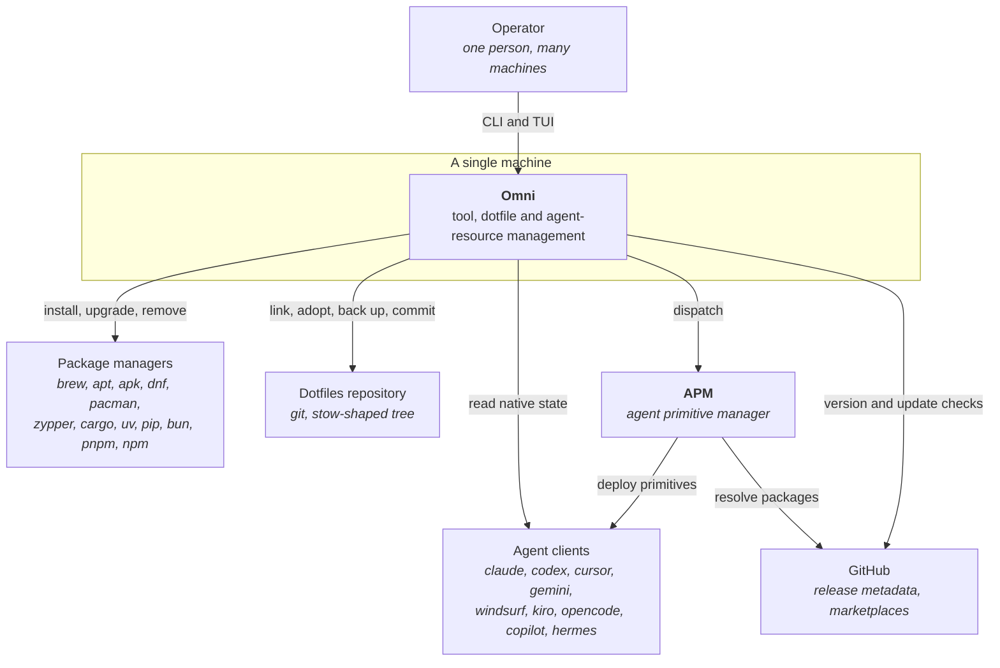
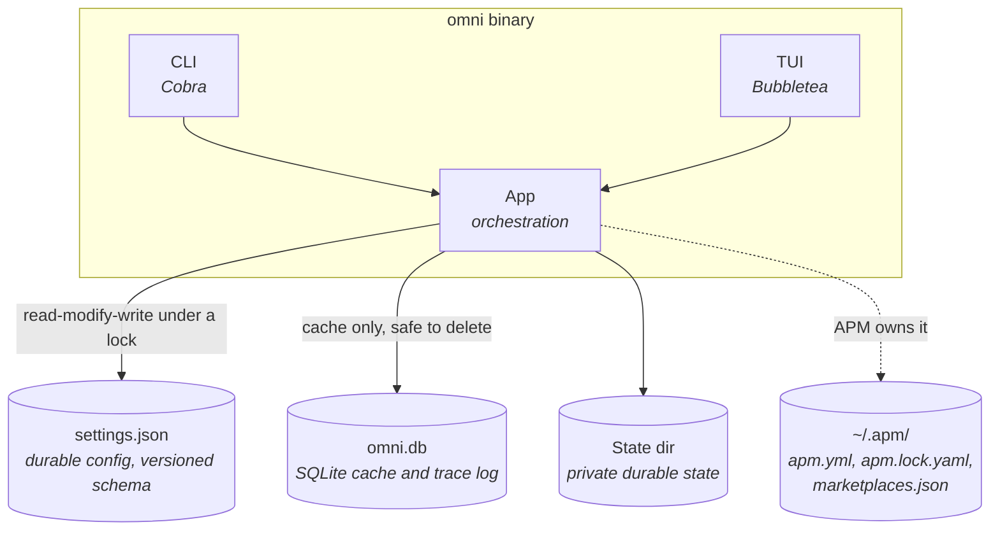
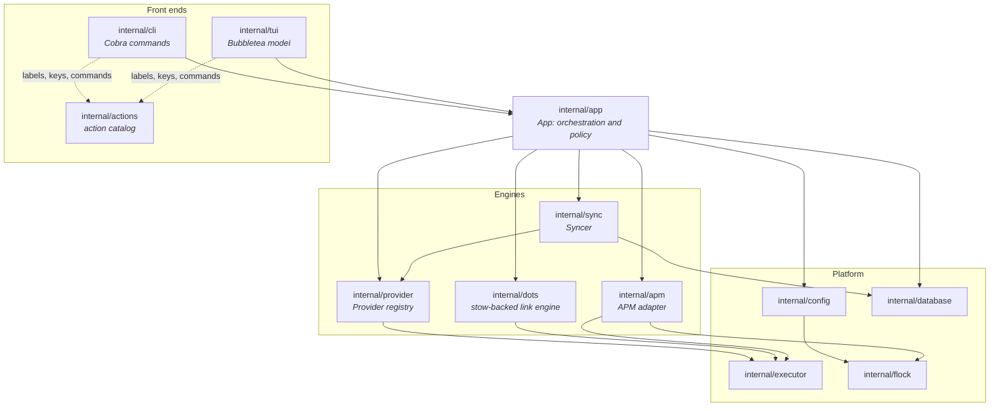
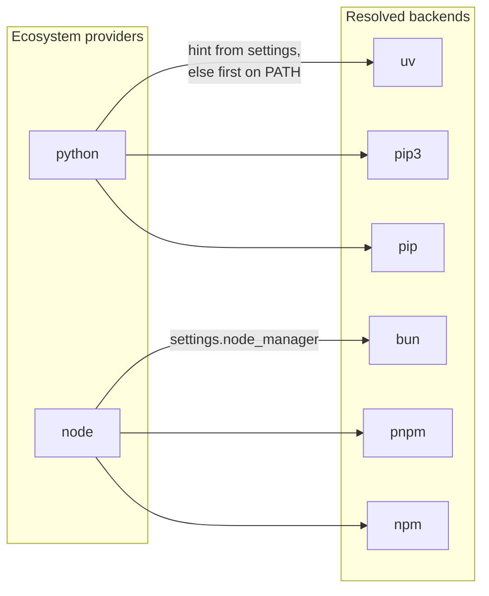
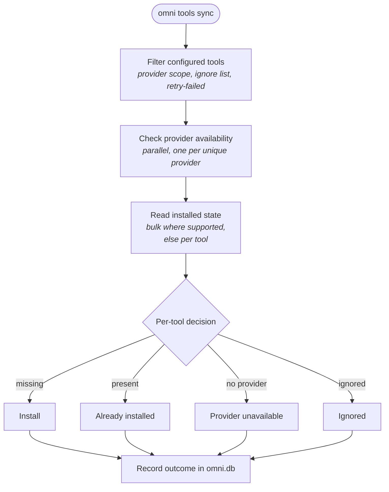
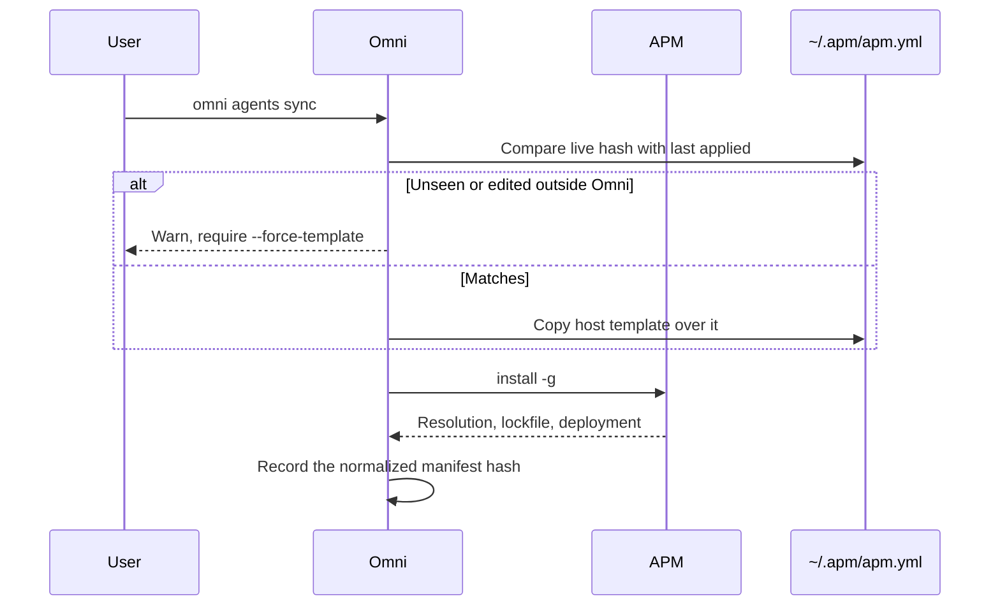

# Architecture

Omni is a single Go binary. It owns tool and dotfile configuration; APM owns all
steady-state agent desired and runtime state. This page is the structural
reference: what the system talks to, what it stores, and which package owns
which decision. For the durable file layout see
[State And Files](state-and-files.md); for the ownership rules see
[Core Concepts](concepts.md).

## System context

Omni sits between one operator and the package managers, dotfiles repository,
and agent tooling already installed on a machine. It installs nothing itself:
every mutation is delegated to a tool that already owns that domain.

Omni reads agent clients directly for exactly one purpose — reporting native
artifacts APM does not manage — and never writes them outside the TUI's
explicit per-artifact removal. See
[Native items APM does not manage](agents.md#native-items-apm-does-not-manage).

## Containers

There is no server and no daemon. The binary is the only executable, and the
three stores below it are independent.

`settings.json` is the single source of truth; `omni.db` is a cache that can be
deleted at any time — tool and agent update checks are recorded there so a view
can show the last known answer before a fresh check returns; the state directory
holds private durable state such as migration wrappers. Omni keeps no parallel agent manifest, ownership ledger, or
runtime deployment model — `~/.apm/` is APM's, and Omni's only write to it is
described under [Agent manifest boundary](#agent-manifest-boundary).

Both front ends enter through the same object. `main` calls `cli.Execute`, which
builds the Cobra root, constructs one `app.App` in `PersistentPreRunE`, and hands
it to every subcommand. A bare `omni` and `omni ui` both construct
`tui.New(ctx, app)` over that same App, so the TUI is a second front end over
the orchestration layer rather than a parallel implementation.

## Components

Roughly 95k non-test lines across 35 packages. `internal/app` and `internal/tui`
carry two thirds of it.

| Package | Owns |
| --- | --- |
| `internal/app` | Orchestration and policy. Holds the config path, cache and state dirs, the provider registry, the database handle, and the fallback executor. Every mutating flow is a method here. |
| `internal/cli` | Cobra command tree. Commands are thin: they parse flags, call one App method, and print. |
| `internal/tui` | Bubbletea model, one tab per domain. Reads the same App methods the CLI calls. The five list tabs share one row composer and scroll window (`view_table.go`), one column shrink ladder (`view_columns.go`), one cursor model (`nav.go`), and one screen-line-to-row map for the mouse (`view_hit.go`), so behavior cannot drift per tab. |
| `internal/actions` | The action catalog: one registry entry per product-visible action, carrying label, description, TUI key binding, and CLI command variants. |
| `internal/provider` | The `Provider` interface, the registry, and one subpackage per package manager. |
| `internal/sync` | The `Syncer`: decides per tool whether to install, skip, prune, or report unavailable. |
| `internal/dots` | The dotfile engine: classification, stow-shaped symlinks, adoption, backup. |
| `internal/apm` | The APM adapter and its workspace lock. |
| `internal/config` | `settings.json` load, migration, versioned schema, and the write lock. |
| `internal/database` | SQLite via Bun. Cache tables plus the command trace log. |
| `internal/executor` | External command execution, with a tracing decorator and a mock. |
| `internal/flock` | Advisory file locks. |
| `internal/testguard` | The test sandbox. |
| `internal/testflow` | The flow catalog validator. |

## Providers

A provider is anything that can install, upgrade, remove, and list packages. The
interface is deliberately small — `Name`, `Description`, `Available`, `Install`,
`Uninstall`, `Upgrade`, `IsInstalled`, `ListInstalled` — and everything beyond it
is an optional capability interface the caller type-asserts for: bulk installed
checks, outdated checks, manager-level install and uninstall, pin detection,
descriptors, privilege planning, and error advice. A provider that cannot do
something simply does not implement that interface, so no provider carries stub
methods it does not mean.

Concrete providers register themselves. Each calls `RegisterConcrete` from its
own `init()`, and `internal/provider/all` is a fifteen-line file of blank imports
whose only job is to run those registrations. `BuildConcreteProviders` then
instantiates every registered factory against one executor.

An *ecosystem* provider (`python`, `node`) owns no packages itself: it resolves
to a concrete *manager* at call time. Resolution prefers the pinned hint from
`settings.ecosystems.<name>.manager` and otherwise walks a fixed preference order,
taking the first binary present on `PATH`. `ResolvedName` reports which backend
won, which is how the Syncer records what a tool was actually installed with.
This is why `omni consolidate <ecosystem> <manager>` takes two words: the pair is
resolved to a provider name plus settings through lookup tables in the app layer.

## Sync

The `Syncer` holds nothing but a provider registry and a database handle. It never
constructs providers — it looks them up by name and type-asserts the optional
interfaces it needs.

The two read phases run in parallel per unique provider under an errgroup; the
install and uninstall executions themselves are sequential per tool, so a failing
package cannot race another provider's mutation. Failures, privilege
requirements, and successes are all written back to `tool_cache`, which is what
makes `--retry-failed` and the privilege prompts possible on the next run.

## Dotfiles

Entries follow the GNU stow convention: the repository holds the real file at
`<stow-root>/<package>/<path-relative-to-home>`, and `$HOME` holds a symlink
pointing at it. Classification crosses "does the repo side exist" with what
`lstat` finds at the target, producing one of fourteen states — `synced`,
`missing`, `broken`, `conflict`, `modified`, `local-only`, `repo-only`,
`no-source`, `untracked-linked`, `untracked-conflict`, `ignored`, `inactive`,
`disabled`, `ambiguous`.

Symlink writes are atomic: a temporary symlink is created and renamed over the
target, and both the temp path and the home-relative target path are validated
before the rename. Every destructive path copies the local file into
`~/dotfiles.bkp` first, and the sync path snapshots the repository worktree onto
a dedicated `refs/heads/omni/backup` ref using a scratch index, so the snapshot
never touches HEAD, the index, or the worktree.

Groups and variants are resolved before the engine sees anything: `internal/dots`
receives a flat list of already-resolved entries and has no concept of either.

## Agent manifest boundary

The steady-state agent boundary is a thin adapter around APM: Omni selects and
invokes APM commands, then presents their output in the CLI and TUI. APM owns
manifests, resolution, lockfiles, package installation, marketplaces, plugins,
MCP, and target deployment.

Omni's only write on the agent side is a whole-file copy: sync materializes the
optional host template `~/.config/omni/apm.yml` over `~/.apm/apm.yml`, then
invokes APM install. Omni never edits manifest fields, so the manifest stays a
dotfile-managed artifact and APM stays the sole owner of everything the install
produces.

The recorded hash is Omni's whole state for this surface. A pre-APM host's old
declarations live in a read-only snapshot committed in dotfiles;
`omni agents migrate` previews the rendered manifest, while `--write` publishes
verified local wrappers and updates only the marked host template.

## Configuration

`settings.json` carries an explicit `version`. Loading a file below
`config.CurrentVersion` migrates it forward in memory, and every released schema
version is frozen under `spec/` so an older document stays checkable. A removed
field is not silently ignored: the loader rejects it by name and points at the
command that replaces it, which is how the retired `agents` declarations became a
hard failure rather than a quiet no-op.

Read-modify-write cycles on the file are serialized by a mutex in the App and an
advisory lock on disk, so a TUI action and a concurrent CLI invocation cannot
interleave a lost update. Read-only loads take neither.

## Command execution and tracing

Every external process — `brew`, `git`, `apm`, `claude`, `codex` — goes through
one `Executor` interface whose base method is `Run(ctx, name, args...)`. Optional
capability interfaces add environment, working directory, and stdin variants, and
free functions degrade gracefully when an implementation lacks one.

Three implementations exist: the real one, which augments `PATH` per invocation
rather than mutating the process environment so version-manager shims resolve; a
mock for tests; and a tracing decorator that records every call — command,
duration, exit code, and truncated output — into the `command_traces` table with
secret-shaped values redacted. That table is what `omni trace list` and the TUI's
trace log read, and it is retention-pruned rather than unbounded.

Each command leads its own process group, and cancelling one signals the group.
Commands delegate — apm resolves through git, a provider shells out — and
signalling only the process omni started leaves that work running, to be orphaned
when omni exits. Omni cancels its root context on the way out, so quitting during
an install stops the whole tree. Nothing omni spawns reads the terminal: output
is captured, stdin is a byte reader, and privileged calls use `sudo -n`, so the
commands lose no interactivity by sitting outside omni's own group.

## Locking

Three independent advisory locks guard three independent files. There is no
global lock and no cross-lock ordering to observe, because no flow holds two of
them for different resources at once:

| Lock | Guards | Mode |
| --- | --- | --- |
| Config write lock | `settings.json` read-modify-write | Blocking exclusive |
| APM workspace lock | The global APM workspace | Non-blocking; fails fast rather than queueing |
| Installed-state lock | The provider-scan state file | Shared for reads, exclusive for writes |

SQLite is confined to a single connection with a busy timeout and WAL mode, since
it is single-writer; multi-row writes run in one transaction so a crash leaves the
cache either fully updated or untouched.

## The action catalog

One registry entry per product-visible action ties together what the CLI and TUI
each expose. An entry carries the label, description, whether it mutates, whether
it needs confirmation, its TUI key binding, and its CLI command variants.

An action is dual-surface, CLI-only, or TUI-only, and the third state must be
declared rather than inferred: a CLI-only action sets `CLIOnlyReason` and may not
also carry a TUI binding; a TUI-only action sets `TUIOnlyReason` and may carry no
CLI binding at all. Tests enforce that every action has one of the three shapes,
that no two actions claim the same CLI command plus required-flag combination,
and that every mutating tool and dots action reaches both surfaces.

This is why adding a key to the TUI is not a local change. A key bound to an
action whose CLI command only previews would be a parity violation, caught by the
catalog rather than by review.

## Test architecture

Two mechanisms sit underneath the test suite, and both fail closed.

**The sandbox.** `internal/testguard` activates from its own `init()` whenever the
process is a Go test binary. It builds a disposable HOME, XDG directories, and
TMPDIR, symlink-farms only an approved allowlist of tools onto `PATH`, and
installs an HTTP transport that refuses every non-loopback dial. Filesystem
writes are checked against a nonce-stamped sandbox root. That protects the test
*binary* — but the `go test` driver that launches it would still run with the real
environment, which is why `bash scripts/run-test-safe.sh` is required: it runs
`go test` under `env -i` with an explicit safe environment and validates the flags
it was given. Plain `go test ./internal/...` fails spuriously by design.

**The flow catalog.** `test/flows.json` declares one flow per product-visible
capability, and validation refuses to pass if any registered action is not mapped
to a flow. A flow's requirements are levelled — unit, component, integration,
CLI black-box, TUI black-box, parity — and each required level must cite evidence
that is statically checked against real Go test functions and real testscript
fixtures. A requirement with no evidence must instead be declared a `gap` with a
reason and a target stage; it cannot simply be absent.

A flow that reaches both surfaces must declare `parity`, naming either the
semantic state a mutating flow asserts on both paths or the semantic query a
read-only flow compares. A flow that reaches the TUI must carry `tui_blackbox`
evidence. Together these are what keep the CLI and TUI from drifting into two
different products.
